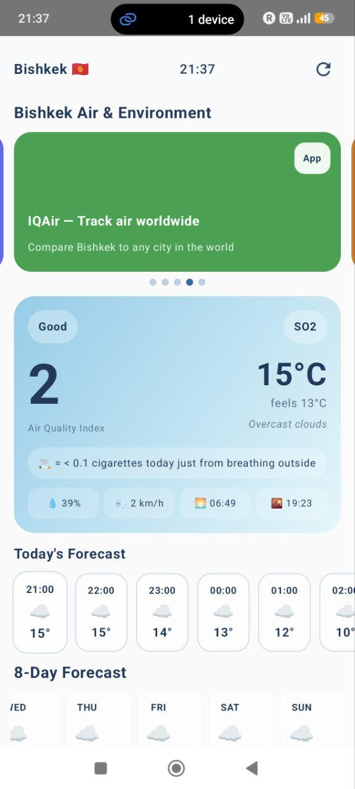
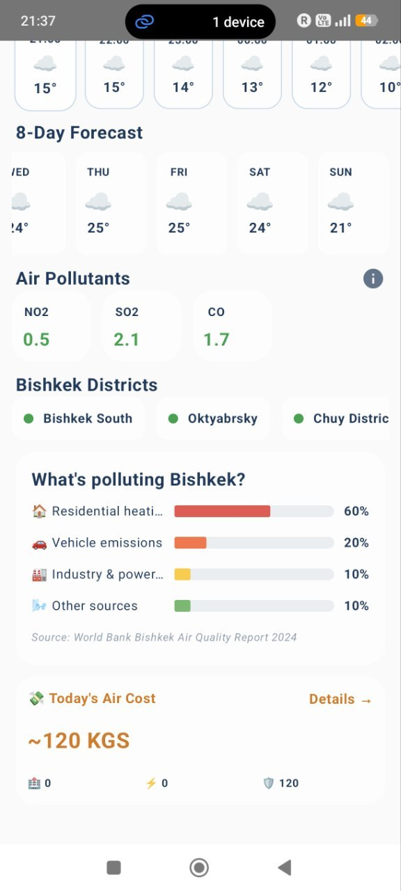
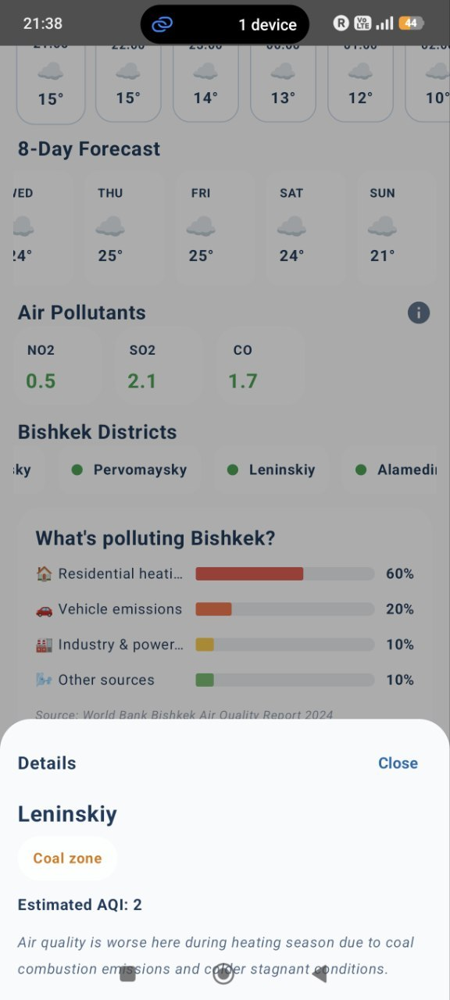
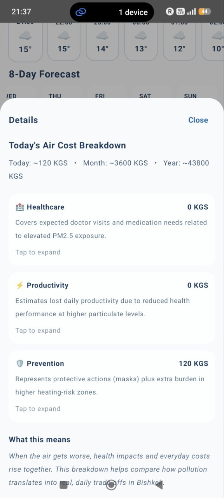
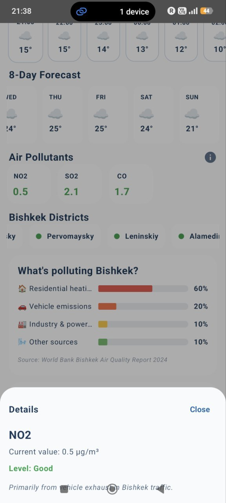

# 🌫️ Tutun — Bishkek Air Quality & Weather App

> **тютүн** (Kyrgyz) — smoke

A weather and air quality app built specifically for Bishkek and Kyrgyzstan.
Tutun shows real-time air quality, current weather, and translates pollution
into terms everyone understands — like how many cigarettes worth of air
you breathed today just by stepping outside.

---

## 📱 Screenshots

  
  
  
  
  

---

## ✨ Features

- **Real-time AQI** — live air quality index for Bishkek updated every 10 minutes
- **Cigarette Equivalent** — PM2.5 levels translated into cigarettes breathed per day
- **Full Weather Data** — temperature, feels-like, humidity, wind, UV index, visibility
- **24-Hour Forecast** — hourly weather with correct day/night icons
- **8-Day Forecast** — daily high/low temperatures and conditions
- **District Air Map** — estimated AQI for all 7 Bishkek districts with heating zone info
- **Air Pollutants** — individual readings for PM2.5, PM10, NO2, SO2, CO, Ozone
- **Pollution Sources** — what percentage of Bishkek's pollution comes from which source
- **Personal Air Cost** — economic calculator estimating daily pollution cost in KGS
- **Trilingual** — Kyrgyz, Russian, Uzbek, and English
- **Bishkek-specific** — built for local context, local data, local users

---

## 🛠️ Tech Stack

| Layer | Technology |
|---|---|
| Language | Kotlin |
| UI | Jetpack Compose + Material3 |
| Architecture | MVVM + StateFlow |
| Networking | Retrofit + OkHttp |
| Local Storage | DataStore Preferences |
| Navigation | Compose Navigation |
| Image Loading | Coil |
| Min SDK | Android 8.0 (API 26) |

---

## 📡 Data Sources

| Data | Source |
|---|---|
| Real-time AQI & Pollutants | [AQICN](https://aqicn.org) — World Air Quality Index |
| Weather & Forecast | [OpenWeatherMap](https://openweathermap.org) One Call API 3.0 |
| Pollution Sources | World Bank Bishkek Air Quality Report 2024 |
| District AQI Estimates | UNICEF / ADB Spatial PM2.5 Research — Bishkek |

---

## 🌍 Why Tutun?

Bishkek experiences some of the worst winter air quality in the world —
PM2.5 levels regularly exceed WHO guidelines by 7–13x during heating season
(November–March). Most air quality apps show a number. Tutun shows what
that number means for your health, your wallet, and your daily life.

The economic cost calculator is based on published research:
- Average Bishkek doctor consultation: 280 KGS
- Productivity reduction formula: Berkeley Earth & WHO research
- District multipliers: UNICEF/ADB spatial PM2.5 studies

---

## 🚀 Getting Started

### Prerequisites
- Android Studio Hedgehog or newer
- Android SDK 34
- Kotlin 2.x

## 📋 Onboarding Flow

The app includes a 3-step onboarding experience:
1. **Language selection** — Kyrgyz (default), Russian, Uzbek, English
2. **Profile setup** — name, age, status (used for personal cost calculation)
3. **Welcome screen** — personalized greeting before entering the app

---

## 🏙️ Bishkek Districts Covered

| District | Zone Type | AQI vs City Average |
|---|---|---|
| Bishkek South | Low risk | 35% better |
| Oktyabrsky | Low risk | 25% better |
| Chuy District | Average | City average |
| Sverdlovsky | Average | 10% worse |
| Pervomaysky | Coal zone | 30% worse |
| Leninskiy | Coal zone | 20% worse |
| Alamedin | Coal zone | 45% worse |

---

## 👨‍💻 Author

Built by an Economics student at OSCE Academy, Bishkek, Kyrgyzstan.

---

## 📄 License

This project is open source and available under the [MIT License](LICENSE).

---

*Built with ❤️ for Bishkek*

---
